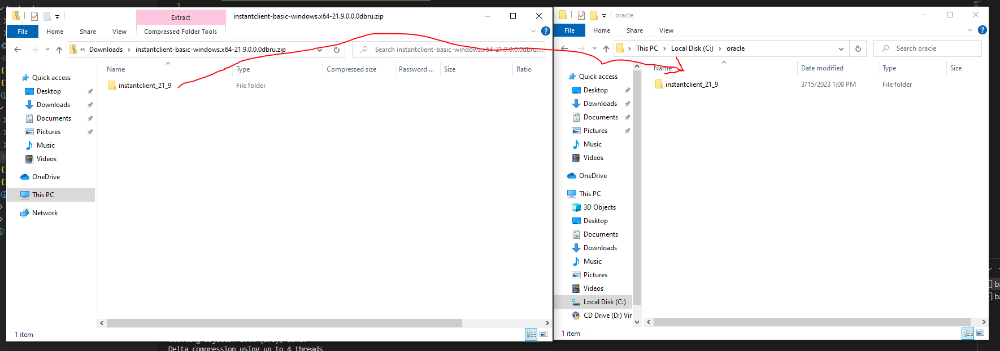
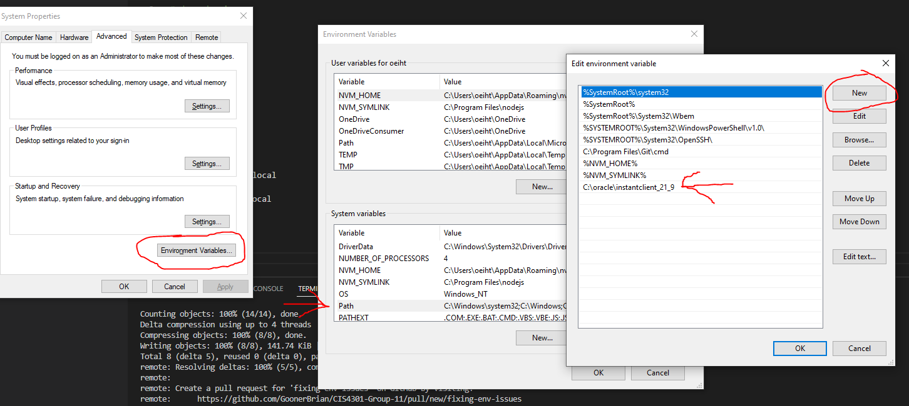

# CIS4301-Group-11 - Main

## Initial Steps

### Install Git Bash (Optional)

Personally, I use Git Bash as my terminal of choice when on a Windows machine. If you prefer something else, feel free to use it. Git Bash can be installed from [here](https://git-scm.com/downloads). I'm not sure what the pros/cons are. It's just what I started using years ago and I'm used to it.

### Node Version Manager NVM (optional but highly recommanded)

NVM doesn't natively work on Windows but a Windows version can be found [here](https://github.com/coreybutler/nvm-windows/releases). Click on the `nvm-setup.exe` file and run. NVM will allow you to easily switch between different versions of Node. Once you've cloned the repo, you'll need to run `nvm install 14.21.2` in both the `backend` and `frontend` directories to ensure that we're all working on the same version of Node. The one down side is you will need to uninstall any existing versions of Node prior to installing NVM.

### Oracle Instant Client (very much NOT optional)

- Download Oracle Instant Client [here](https://www.oracle.com/database/technologies/instant-client/winx64-64-downloads.html). Download the Basic Package zip folder.
- Within the zip folder you will see a folder called `instantclient_21_9`.
- Create a folder called `oracle` in your `C:` drive and copy/paste `instantclient_21_9` into that folder.
  
- Next, you will need to add Instant Client to your `PATH`
- Search for `Environment Variables` in your Windows Search Bar. Something along the lines of "Edit ... Environment Variables" should appear before you finish typing environment.
- Click the `Environment Variables...` button
- Click `PATH` under `System Variables` and click the `Edit` button
- Click `New` and paste the path to the Instant Client folder. If you set it up the same as me, the path with be `C:\oracle\instantclient_21_9`.
  

### Microsoft Visual C++ Redistributable (Required for Windows users)

- Microsoft Visual C++ Redistributable can be downloaded [here](https://learn.microsoft.com/en-us/cpp/windows/latest-supported-vc-redist?view=msvc-170)
- Reboot your machine once the install is complete

### Cloning the repo

- Make a folder somewhere on your computer
- `cd` to that folder from the command line
- Run `git@github.com:GoonerBrian/CIS4301-Group-11.git` to clone the repo

### Connect to the University of Florida VPN

Connect to the [University of Florida VPN](https://it.ufl.edu/ict/documentation/network-infrastructure/vpn/)

### Pulling in the latest changes to your local environment

If changes are made in the repo, you will need to pull those changes in by doing the following:

- `cd` to the `CIS4301-Group-11` directory (if not already there)
- Run `git pull origin main`

### Contributing

All work needs to be commited and pushed on a branch other than main. Creating a branch can be done in 2 different ways.

#### Option 1: Create branch from terminal

From the `CIS4301-Group-11` directory run `git checkout -b <branch-name>` (i.e., `git checkout -b this-is-my-branch`). This will
automatically switch you and all of you changes over to your new branch. See **Pushing your changes to the repo** for the alternate `push` command you will need
to run.

#### Option 2: Create branch in Github and pull into you local repo

- Login to Github and go to `code` -> `branches`
- Click the `New Branch` button
- Name the branch whatever you like
- Complete steps from **Section 4**
- Run `git checkout <branch-name>` (i.e., `git checkout this-is-my-branch`)

### Pushing your changes to the repo

If you've made changes locally and you want to commit and push those changes to the repo, do the following:

- `cd` to the `CIS4301-Group-11` directory (if not already there)
- Run `git add .` to stage all changed files
- Run `git commit -m "your commit message"` to commit your local changes
- Run `git push` to push your changes to the repo (If you created your branch through the terminal, an error will pop up with the alternative command that you need to run the first time you push changes from this branch. The command will look like this, `git push --set-upstream origin <branch-name>`. Any additional pushes from this branch will only require the `git push` command.)

## Backend Setup

Please see the README.md in the `backend` folder for instructions on setting up the backend that can be found [here](https://github.com/GoonerBrian/CIS4301-Group-11/blob/main/backend/README.md).

## Frontend Setup

Please see the README.md in the `frontend` folder for instructions on setting up the frontend that can be found [here](https://github.com/GoonerBrian/CIS4301-Group-11/blob/main/frontend/README.md).

## Setup on Apple Silicon Macs

Please see [this](https://github.com/GoonerBrian/node-oracledb-on-m1-mac) repo for instructions on setting up your Apple Silicon Mac to run this app locally.
